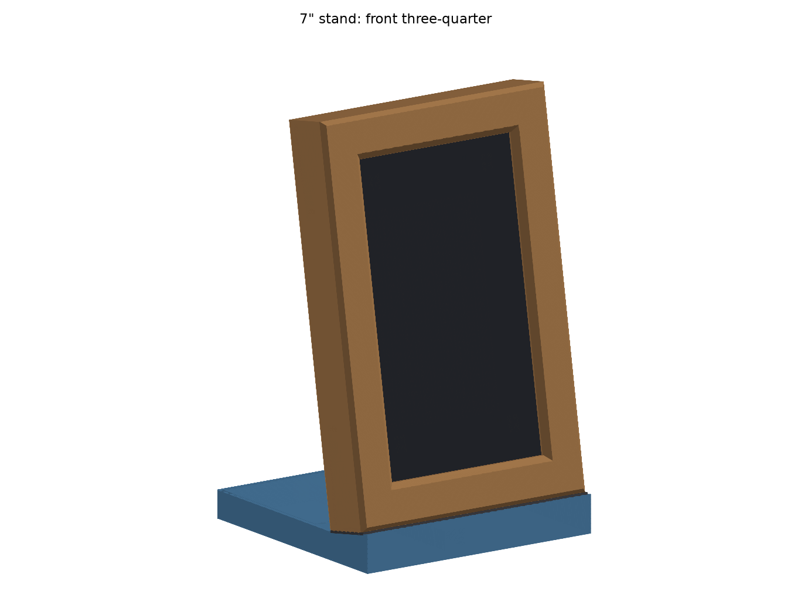
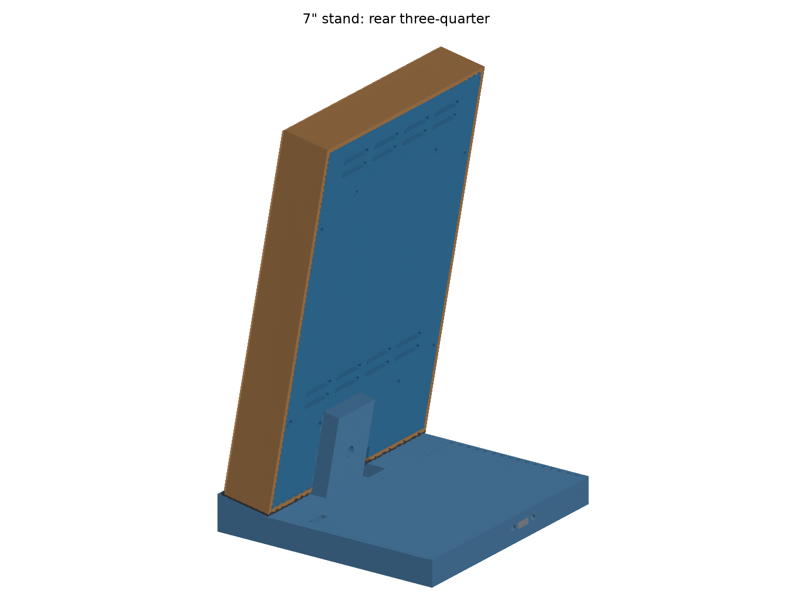
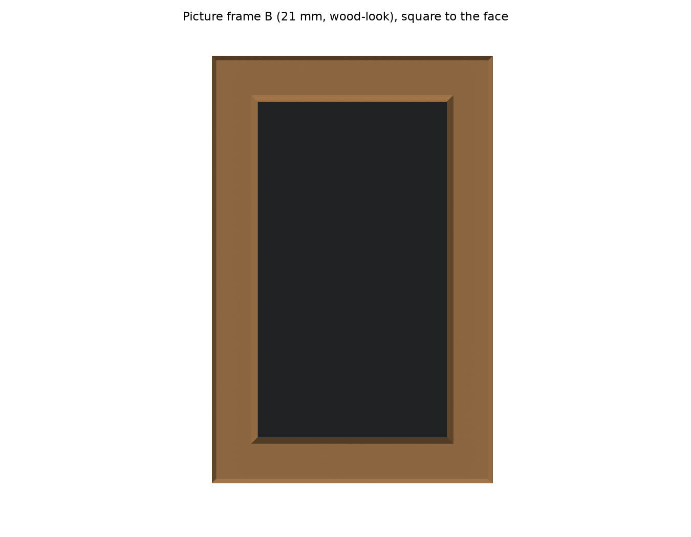
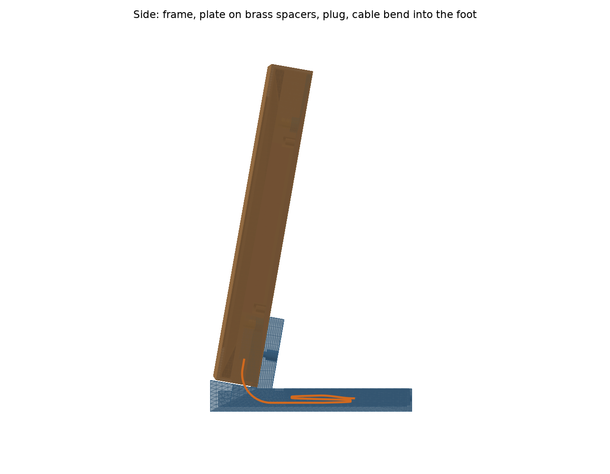
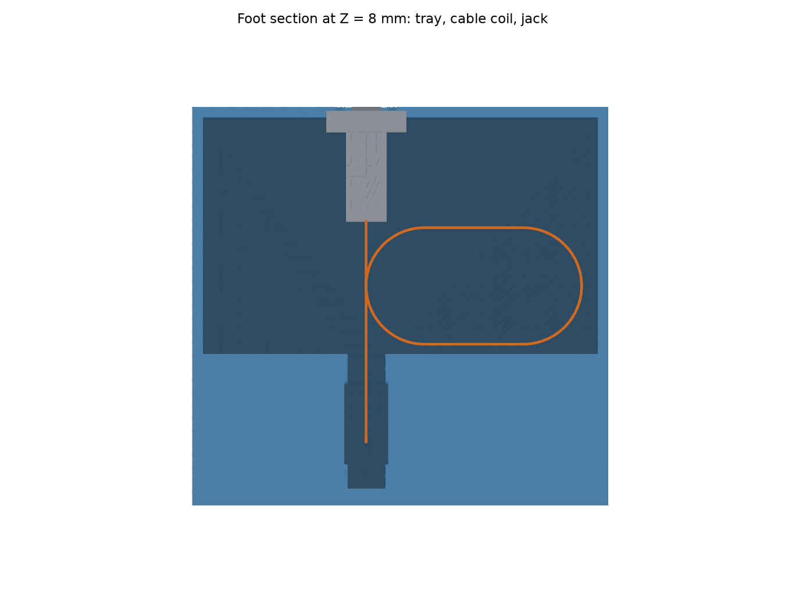
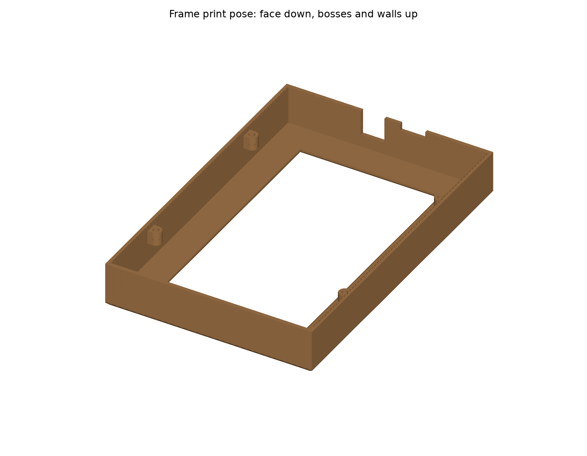

# Espframe 7" portrait desk stand

A 3D-printable portrait desk stand for the 7" espframe (Waveshare ESP32-S3-Touch-LCD-7, Rev1.2), with a wood-look picture frame round the screen. It's a parametric Python model built with [build123d](https://github.com/gumyr/build123d). One command rebuilds every print file, the preview images, and a set of fit and stability checks. The 10" Guition version will follow once this one has been printed and checked; everything known about it so far is in [docs/10-inch.md](docs/10-inch.md).

| | |
|---|---|
|  |  |
|  |  |
|  |  |

## How it works

- **Picture frame (wood-look PLA).** Style B, classic bevel, with a 21 mm face.
  - The opening is the picture area plus a 0.75 mm reveal (88.22 × 156.38), and the face is the same width all round. That hides the panel's uneven black bezel (11 / 13 / 19 / 19 mm) behind an even border, so the frame sits 1 mm right of the glass centre.
  - The face is 4 mm thick, with a 45° × 3 mm bevel into the opening and a 2 mm outer chamfer.
  - The frame hangs on the back-plate: four M3 × 8 screws from behind, through the plate's edges, go into inserts in bosses on its side walls. Its bottom rail sits on felt on the foot's ledge.
  - It never touches the glass. 1 mm felt on the back of the face stays 0.2 mm off the glass, and the walls clear the glass edges by ≥ 0.7 mm.
- **Back-plate (3 mm PETG).** It screws to the four M3 brass spacers that Waveshare already fits to the panel (8 mm, on ~2 mm tabs, tops at 10 mm).
  - Four printed risers (Ø9 × 4.5) sit on the spacers, lifting the plate to 14.5 mm above the panel back. That clears the tallest part, the 12 mm UART2 JST, by 2 mm (designed to 12.5).
  - It fills the frame out to its walls (0.3 mm clear), so the back is closed all round, and carries the frame on four screws near its side edges.
  - Two rows of vent slots low down and two near the top (4 slots of 20 × 3 mm each) let air through, since the back is otherwise closed.
- **Foot (PETG).** The plate slides down onto a dovetail rail on the foot's post, and the frame's bottom rail settles on the felted ledge (18 mm high). The screen leans back at 10°.
  - No ballast: the printed stand was sturdy without it, and the front under the ledge is solid. The foot is 118 mm deep.
  - The tray is open on top and closed with a drop-in lid.
- **Power and data.** A Poyiccot USB 3.1 panel-mount extension (straight, 30 cm) passes every pin through:
  - Its plug goes into the board's UART (CH343) USB-C port.
  - The lead drops through notches in the plate and frame and through the deck slot, bends at R18, lies as one loose coil in the tray, and ends at the panel jack in the rear wall.
  - Any USB-C charger works, and you can flash or read logs through the stand without taking it apart.
- **Orientation.** The board's USB edge goes down: the landscape panel turned 90° counter-clockwise, seen from the front. Pick the matching rotation in the espframe settings (COM-362).

## Building

```bash
pnpm nx run espframe-stand:cad
```

This creates (or refreshes) a local Python venv (`setup.sh`, Python 3.10–3.13, pinned `requirements.txt`) and then runs `python -m stand.build`, which:
- builds every part and writes `out/espframe-7in-stand-<part>.{stl,3mf,step}`. `out/` is gitignored;
- runs the checks below, writes `out/checks.txt`, and exits non-zero if any check fails;
- renders the preview PNGs into `docs/`. These are committed so this README shows them.

The targets are local-only on purpose. They aren't called `build`, `test` or `install`, so CI and `pnpm install` never download build123d's ~150 MB of CAD libraries.

Every dimension is a named constant in [`stand/params.py`](stand/params.py), tagged `MEASURED`, `SOURCED`, `DESIGN` or `EST`. Change a value and re-run the target. Material densities are parameters too: `PETG_DENSITY` for the structural parts, and `FRAME_DENSITY` for the wood-fill frame.

## Checks

| Check | Result |
|---|---|
| Plate clears the UART2 JST keep-out (whole PCB footprint up to 12.5 mm) | 2.00 mm (need ≥ 2.0) |
| Risers seat on the brass spacer tops | exact, no overlap |
| M3 × 12 engagement in the spacer | 4.5 mm of 6–7 mm thread (M3 × 14 would be borderline) |
| Dovetail clearance | 0.02 mm per side on the angled flanks (set from the printed coupon), no interference; flat plate-to-post gap 0.2 mm |
| Dovetail engagement | 31.8 mm of the 35.5 mm rail (need ≥ 30; the frame raises the screen 3.7 mm above the ledge) |
| Plug clear of the plate, frame and foot | no overlap |
| Cable bend radius | tightest 18.0 mm (limit R18, est.) |
| Cable length | 265 mm path of 300 mm (35 mm slack) |
| Cable clearance along its length | ≥ cable radius everywhere |
| Plug bend fits above the tray floor | 5.6 mm of straight drop to spare (rev D without the frame had 1.9) |
| Tip-over: push at the screen centre to tip it back | **4.6 N** (need ≥ 4.5, set from the printed stand feeling sturdy without ballast; rev A design was 3.2 N) at 118 mm deep. Sideways tip at 34°. Weight stuck under the front raises it (about +0.8 N per 100 g). |
| Frame opening clear of the picture | 0.75 mm reveal on every side (need ≥ 0.5) |
| Frame never touches the glass | closest 0.71 mm (need ≥ 0.5) |
| Glass edge gap L / R / T / B | 8.75 / 6.71 / 0.71 / 0.71 mm |
| Face felt clears the glass | 0.20 mm, none over the picture |
| Only the picture shows through the opening | head-on, nothing but glass inside the opening: no frame, felt, plate, spacers or plug |
| Plate edges meet the frame bosses | flush contact, no overlap |
| Frame screw engagement | M3 × 8 through the 3 mm plate: 5 mm into a 6 mm hole with an M3 × 4 insert |
| Frame rail seats on the ledge | on 1 mm felt; frame to foot never closer than 0.2 mm elsewhere |
| Jack fits its recess and window | measured flange 25 × 8 × 6.5 bears on the 1.2 mm web inside the rear wall; no overlap |
| Receptacle flush with the rear face | the metal USB-C receptacle (1.2 mm proud of the flange) pokes through a 9.3 × 3.7 window and ends flush |
| Jack screws from outside | the jack's own screws (16.5 mm pitch) pass 0.3 mm clear of its body. Their heads leave 11 mm between them, so a charger plug moulding wider than that can't seat fully: test yours |
| Foot-lock screw (optional) | M3 × 12 engages 5.8 mm in an M3 × 4 insert |
| Every part fits the P1S bed | yes (frame 130 × 198 × 28) |

The tip-over figure uses the modelled part volumes, each part's material density and an estimated fill fraction (`PRINT_FILL` 0.55 for PETG, `FRAME_FILL` 0.85 for the thin frame), plus the 354 g screen. Weigh your printed parts and update the fill values to tighten it.

## Parts to print

Structural parts are PETG on the stock Bambu P1S profile with the 0.4 mm nozzle. The frame is wood-look PLA (see below).

| File | Orientation | Settings |
|---|---|---|
| `coupon-dovetail` | As exported: the groove block lies groove-down (like the plate), and the five rail blocks stand on end so each rail runs straight up (like the foot post). Don't lay the rails flat: their angled sides print as undersized steps and every fit reads too loose. | 4 walls. **Print first.** 1–3 notches on top of each rail block mark 0.02 / 0.03 / 0.04 mm clearance per side (round 3; round 2's 0.05 was closest but a touch loose). `coupon-dovetail-rails` is the rails alone, to reuse an already-printed groove block. Pick the tightest that slides through by hand and set `SLIDE_CLEAR` to it. The rail tip keeps 0.4 mm off the groove floor (`DOVE_TIP_CLEAR`) whatever the clearance, in case the bridged floor sags. |
| `coupon-receptacle` | Flat as exported | 100% infill, 0.2 mm layers. Three thin plates (1–3 notches = 1.0 / 1.2 / 1.4 mm), each a copy of the rear-wall web: receptacle window and two holes at the measured 16.5 mm flange pitch. Screw one onto the flange with the jack's own screws: the screws threading straight in confirms the pitch, and the plate the metal receptacle ends flush with sets `JACK_RECEPTACLE_PROUD` (plate 2, 1.2 mm). Plug your chargers into it to check the screw heads don't stop them seating. |
| `plate` | As exported: back face on the bed, risers and spine up. The dovetail groove's undercut faces the bed and prints without supports. | 4 walls, 40% infill (the risers end up solid), 0.2 mm layers |
| `foot` | As exported: upright on its base | 4 walls, 25% infill, no supports. |
| `lid` | Flat | 3 walls |
| `frame` | As exported: face down on the bed, walls and bosses up. The bevel and outer chamfer are 45° overhangs: no supports. | Wood-look PLA, 3 walls, 20% infill. See the wood-look notes. |

### Wood-look frame

- **Material.** Two good options:
  - **Bambu Lab PLA Wood** (real wood fibre) on a **0.6 mm nozzle**. Bambu's data sheet lists 0.4, 0.6 or 0.8 mm nozzles, but higher wood contents clog a 0.4 mm nozzle, so 0.6 is the safe choice. Use 0.28 mm layers.
  - **Polymaker PolyWood**, which gets its wood look from foamed PLA with no fibre, on the stock **0.4 mm** nozzle.
- **PLA is fine here.** Wood-fill PETG exists but is rare, and PLA does the job: the frame only carries the screen's ~0.45 kg down to the ledge in compression, plus four lightly tightened screws. The load-bearing parts (plate and risers, foot, lid) stay PETG.
  - PLA softens around 55–60 °C, so keep the stand out of direct sun and hot cars.
  - Use the spool's own temperature, and don't leave the nozzle idling hot: wood fibre chars and clogs.
- **Finish.** A smooth build plate gives a clean front face; a textured plate gives a matte grain. Wood fill can be sanded and stained.
- **Mass.** The frame is about 76 g in wood-fill PLA (`FRAME_DENSITY` 1.18 g/cm³; PolyWood is lighter).

## Bill of materials

| Qty | Part | Notes |
|---|---|---|
| 1 | Poyiccot USB 3.1 Type-C panel-mount extension, straight male to female, 30 cm | Plug into the board's UART (CH343) port |
| 4 | M3 × 12 pan head + M3 washers | Plate to brass spacers. Don't overtighten into the printed risers. |
| 4 | Waveshare stock M3 brass F-F spacers, 8 mm | Already on the panel; reused |
| 4 | M3 × 8 pan head + M3 washers | Plate to the frame |
| 4 | LUKAISEN M3 × 4 × 4.2 heat-set inserts (user's kit) | Frame side-wall bosses |
| 1 | LUKAISEN M3 × 4 × 4.2 heat-set insert + 1 M3 × 12 | Optional foot lock (plate spine) |
| 1 | 1 mm adhesive felt, ≈ 540 × 6 mm | Back of the frame face, over the black bezel only |
| 1 | 1 mm adhesive felt, ≈ 130 × 28 mm | Ledge seat under the frame's bottom rail |
| 4 | Small rubber feet | Under the foot |

No heat-set kit? Buy an M3 assortment. Inserts go in with a soldering iron, pressed in square and flush. Use **220–240 °C for PETG** (plate, foot) and **about 190–200 °C for the PLA frame**. The wood-fill frame is more brittle than PETG, so snug its M3 × 8 screws and don't crank them. Hole size is `INSERT_HOLE_D` (OD − 0.2 = 4.0 mm); confirmed snug and flush in PETG on a test print. The wood-fill frame is untested; if its inserts go in loose or crack a boss, tune it there.

## Assembly

1. **Inserts.**
   - Four M3 × 4 inserts go into the frame's side-wall bosses, at PLA temperature.
   - If you're using the foot lock, one M3 × 4 insert goes into the plate spine from the groove floor.
2. **Felt.** Stick the 6 mm felt strip on the back of the frame face, on the band that covers the black bezel. Keep its inner edge at least 1 mm outside the opening (`FELT_INSET`) so it stays hidden at an angle. Stick the wide strip on the foot's ledge.
3. **Jack.** With the lid off, set the jack inside the tray against the rear wall, receptacle outwards, so the flange drops into its recess and the receptacle pokes through the window. Fit the jack's own two screws from outside through the wall into the flange's threaded holes.
4. **Cable.** Lay the spare cable as one loose coil in the tray beside the jack, no tighter than about 40 mm across. Then run it forward through the tunnel and push the plug up through the deck slot (14 × 8 mm; the 12.5 × 6.5 plug fits through).
5. **Plate.** Screw the plate to the four brass spacers with M3 × 12 + washers. The spine and dovetail groove go to the bottom, near the USB edge.
6. **Frame.** Lay the screen face down on a soft cloth and lower the frame over it. Fix it with four M3 × 8 + washers from behind, through the plate's edge holes into the frame inserts. Check the even border, and that the felt only rests on the black bezel.
7. **Plug and mount.** Plug the straight plug into the board's UART USB-C. Lower the plate's groove onto the foot's rail and let it slide down until the frame's bottom rail sits on the felted ledge. The plug's lead runs down through the notches in the plate and frame and into the deck slot.
   - Optionally, fit the foot-lock M3 × 12 from the back of the post.
   - Drop the lid in.
8. **Rotation.** In the espframe settings, pick the rotation (90 or 270) that shows the picture upright.

## Open items

These are estimated until the parts arrive. Each is a parameter in `stand/params.py`.

- **Poyiccot jack:** measured and confirmed on test prints (flange 25 × 8 × 6.5, threaded M3 holes 16.5 apart, body 12.5 × 8, 34.5 long, receptacle 1.2 mm proud). Still to check: your chargers seat fully between the screw heads.
- **Plug length:** confirm the 35 mm includes the 7.5 mm tip, so 27.5 mm sticks out.
- **Cable:** confirm the diameter (4.5) and that it takes an R18 bend without levering on the board's port. There's 5.6 mm of drop to spare under the plug.
- **UART port:** confirm which of the two USB-C ports is the UART (CH343) one, and that the pair is on the left edge seen from the front.
- **Weights:** weigh the printed parts, update `PRINT_FILL` / `FRAME_FILL`, and re-run to refresh the tip-over number.
- **Frame fit:** print the frame and check that the border looks even on your panel. Tune `REVEAL` and `FRAME_FACE_W` if needed.

Design history and sources: the desk-stand audit (plan revs A–D and the frame concept) and Linear COM-363.
